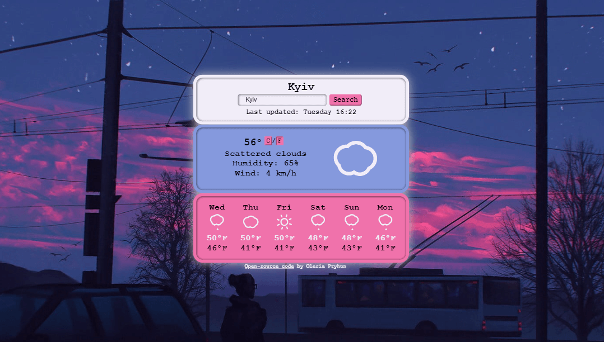

> I am a junior front-end developer.
>
> This pet project was created for my portfolio during my studies.

# Project 1: Weather-App

You have to start somewhere! My first React project - simple, stylish... well, merely usefull, but working!

## Features

- Type a city name to check today's weather and the weather forecast for 6 days;
- You can switch between Fahrenheit and Celsius;
- Error pop-up shows if the city is typed wrong;
- Submit button is disabled if input field is empty.

## Skills used

- React
- Sass/Scss
- Git + Bash

## What did I learn

- Making **independent** and **reusable** components;
- Using **external API**;
- Making **HTTP requests** using **Axios**;
- Using **SCSS** and **CSS modules**;
- Creating **responsive layouts**.
- Using **libraries** (e.g. "classnames", "react-animated-weather")

Here you can check the <a href="https://weather-app-developer-pryhun.netlify.app/" target="_blank">deployed site</a>!
